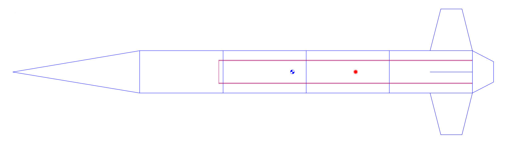

# Pima

> L2-class testbed for 54 mm motors, with a focus on durability and ease-of-assembly


### Properties

| Diameter | Length | Dry Weight | Loaded Weight | Static Stability |
|----------|--------|------------|---------------|------------------|
| in       | in     | lb         | lb            | - cal            |



### Performance

### Media

## File Formats

| Purpose     | Application      | Format    |
|-------------|------------------|-----------|
| Spreadsheet | LibreOffice Calc | `*.fods`  |
| CAD         | Onshape          | `*.step`  |
| CAM         | PrusaSlicer      | `*.stl`   |
|             |                  | `*.3mf`   |
|             |                  | `*.gcode` |
| Simulation  | OpenRocket       | `*.ork`   |
|             | RASAero II       | `*.CDX1`  |
|             | RASP Motor       | `*.eng`   |

## Directory Index

```
.
├── cad/
│   ├── avbay/
│   ├── bulkhead/
│   ├── drawing/
│   ├── fastener/
│   ├── motor/
│   └── nosecone/
├── cam/
│   └── bulkhead/
├── decal/
│   ├── design.odp
│   ├── sara_logo.pdf
│   └── Tripoli-rocketry-association.svg
├── doc/
│   ├── openrocket.png
│   └── placeholder
├── license
├── materials.gdsheet
├── pima.ork
├── readme.md
└── update_index.sh

11 directories, 10 files
```
